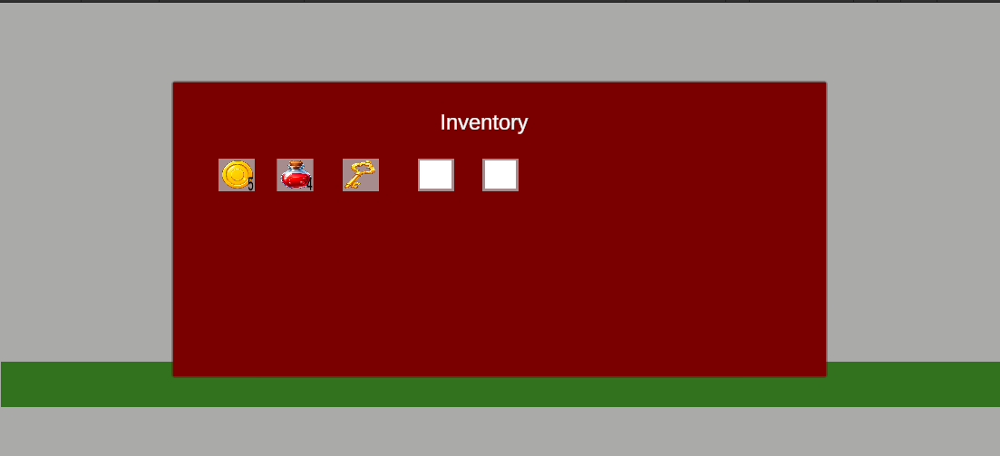

# Unity 2D Inventory System

A simple 2D inventory prototype built in Unity and C#.

## Gameplay Demo

> Click the image above to watch the gameplay demo.

## Features

- 2D player movement
- Item pickup system
- 5-slot inventory UI
- Inventory opens with `I`
- Inventory closes with `ESC`
- Stackable item quantities
- Multiple item types: coins, potions and key
- Potion use system
- Potion can be used with `H`
- Player HP increases when using a potion
- Potion quantity decreases after use
- Inventory slot clears when item quantity reaches 0

## What I Learned

- Creating an inventory UI in Unity
- Working with UI Image slots
- Updating TextMeshPro quantity text
- Using Lists to manage inventory slots
- Creating stackable item logic
- Detecting item pickup with `OnTriggerEnter2D`
- Using item sprites inside UI slots
- Managing item quantities separately for each slot
- Creating a basic consumable item system

## Controls

- A / D or Arrow Keys: Move left/right
- I: Open inventory
- ESC: Close inventory
- H: Use potion

## Tech Used

- Unity
- C#
- Rigidbody2D
- Unity UI
- TextMeshPro
  
## Notes

This project focuses on gameplay programming and logic, not final art or level design.

## Project Status

Completed prototype v1.
